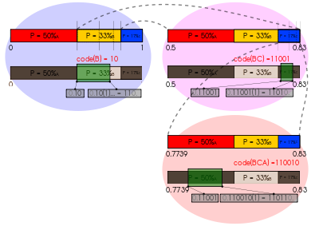

## **Huffman and Arithmetic** #
***
This project using two open source prject provided two algorithms for encoding/decoding text file 
## **Teachnics Description** #
***
This project use two algorithms, one is huffman and the other is arithmetic. For both of them,Data is encoded as a string of bits (0 and 1), and they provide a more efficient way of coding, i.e., encoding with fewer bits, thus achieving distortion-free data compression. 

Below figure is a huffman tree
<div>

</div>
Below figure is a arithmetic tree
<div>

</div>


## **Demo Setup** #
1.All the required steps to compile and run the program is in the Hw3_opensouce.pdf  
2.gcc version must be at least 8.1.0  


```python

```


```python

```
